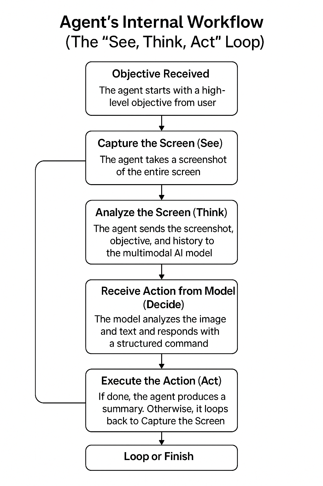

# Self-Operating Computer Framework

> An experimental framework to enable multimodal models to operate a computer for both open-ended tasks and automated end-to-end testing.

<!-- TODO: Record and replace with a GIF of the agent in action -->


The Self-Operating Computer Framework is a project that lets you control a computer using natural language. By leveraging multimodal vision models, the agent can "see" the screen and interact with GUI elements, just like a human. This opens up possibilities for general computer automation and provides a novel way to conduct true end-to-end testing for web and desktop applications.

## Core Features

- 🤖 **Natural Language Control:** Operate your computer by giving it plain English objectives.
- 🔬 **Multimodal Vision:** The agent sees your screen and understands the UI to decide its next action.
- 🧪 **E2E Testing Agent:** A built-in server to run automated, browser-based, and desktop application tests via a simple API.
- 🔌 **Extensible:** Designed to be compatible with various multimodal models.

## How It Works

The agent operates on a simple yet powerful "See, Think, Act" loop. Here’s a step-by-step breakdown of the internal workflow:

1.  **Objective Received:** The agent starts with a high-level objective from the user.

2.  **See the Screen:** The agent takes a screenshot of the current screen to get a visual representation of the user interface.

3.  **Extract UI Text with OCR:** This is a critical step. The agent uses **EasyOCR** to scan the screenshot and extract all visible text along with its precise coordinates on the screen. This gives the model a machine-readable understanding of the UI, complementing the visual data.

4.  **Think and Decide:** The agent sends the screenshot, the extracted OCR data, and the original objective to a multimodal AI model (like Gemini). It asks the model, "Based on the screen, the text elements available, and my goal, what is the single next action I should take?"

5.  **Act on the UI:** The model responds with a specific command, such as `click`, `write`, or `press`. The agent then uses GUI automation libraries to execute this command, for example, clicking on coordinates provided by the OCR data or typing text into a field.

6.  **Loop Until Done:** The cycle repeats—capturing the screen, extracting text, thinking, and acting—until the model determines the objective is complete and returns a `done` command.

 
---

## Mode 1: General Purpose Agent

This mode allows you to use the agent for open-ended tasks on your computer. You can ask it to perform tasks, browse the web, or interact with applications.

### Installation

The agent is run from source. Follow these steps to get started:

1.  **Clone the repository:**
    ```bash
    git clone https://github.com/your-username/self-operating-computer.git
    cd self-operating-computer
    ```

2.  **Install dependencies:**
    ```bash
    pip install -r requirements.txt
    ```

3.  **Set up API Keys:**
    You will need an API key from a supported multimodal model provider (e.g., Google, OpenAI). Create a `.env` file in the project root:
    ```bash
    cp .env.example .env
    ```
    Then, open the `.env` file and add your API key:
    ```
    GOOGLE_API_KEY="your_google_api_key_here"
    # or
    # OPENAI_API_KEY="your_openai_api_key_here"
    ```

### Usage

Run the agent from your terminal using the `operate` command. You must specify which model to use.

**Default Interactive Mode**

This will prompt you to enter an objective in the terminal.

```bash
operate --model gemini-2.5-flash
```

**Direct Prompt Mode**

Execute a specific objective directly from the command line.

```bash
operate --model gemini-2.5-flash --prompt "Look up today's weather in San Francisco and write it in a new text file on the desktop."
```

---

## Mode 2: End-to-End Testing Agent

This mode runs a dedicated API server, allowing you to programmatically run UI tests for both web and desktop applications.

### How It Works

The testing agent uses a simple, robust architecture:
- An **API Server (FastAPI)** accepts test requests.
- A **Job Queue** holds incoming tests.
- A single **Worker Thread** picks up jobs from the queue and runs them one at a time. This sequential execution is critical to prevent multiple tests from fighting for control of the mouse and keyboard.

### Setup & Running the Server

After following the main installation steps, you can start the server.

**Important:** The server must be run from a terminal that has access to the computer's graphical user interface (GUI). Do not run it in a headless environment.

```bash
python -m uvicorn api.main:app
```

The server will start, along with the background worker thread. You will see logs from the agent in this terminal window.

### API Usage

**1. Submit a Test**

Send a `POST` request to the `/api/tests` endpoint with your test objective.

- **Endpoint:** `POST /api/tests`
- **Body:** `{"objective": "Your test objective here"}`

**Example (Web):**
```bash
curl -X POST -H "Content-Type: application/json" \
  -d '{"objective": "Go to github.com, search for 'self-operating-computer', and open the first result."}' \
  http://127.0.0.1:8000/api/tests
```

**Example (Desktop):**
```bash
curl -X POST -H "Content-Type: application/json" \
  -d '{"objective": "Open the system settings, go to the display section, and check if night mode is enabled."}' \
  http://127.0.0.1:8000/api/tests
```

The API will immediately respond with a `job_id`.

**2. Check the Result**

Send a `GET` request to the `/api/tests/{job_id}` endpoint to check the status and result of your test.

- **Endpoint:** `GET /api/tests/{your_job_id}`

**Example:**
```bash
curl http://127.0.0.1:8000/api/tests/your_job_id_here
```

The response will include the status (`QUEUED`, `RUNNING`, `SUCCESS`, or `FAILURE`) and the final result.

### Limitations & Best Practices

- **Sequential Execution Only:** The system is designed to run one test at a time. It is not a solution for high-concurrency, parallel test execution.
- **No Headless/CI/CD Support:** The agent requires a real desktop environment with GUI access. It **cannot** run in a standard headless Linux container used by most CI/CD platforms (like GitHub Actions).
- **Environment Brittleness:** Tests interact with the screen directly, so they can be sensitive to screen resolution, OS theme (light/dark mode), and the initial state of applications. A test written on one machine may need adjustments to run reliably on another.
- **Keep Objectives Focused:** For best results, write clear and specific objectives that target a single goal. Avoid long, complex, multi-part tests in a single objective.
