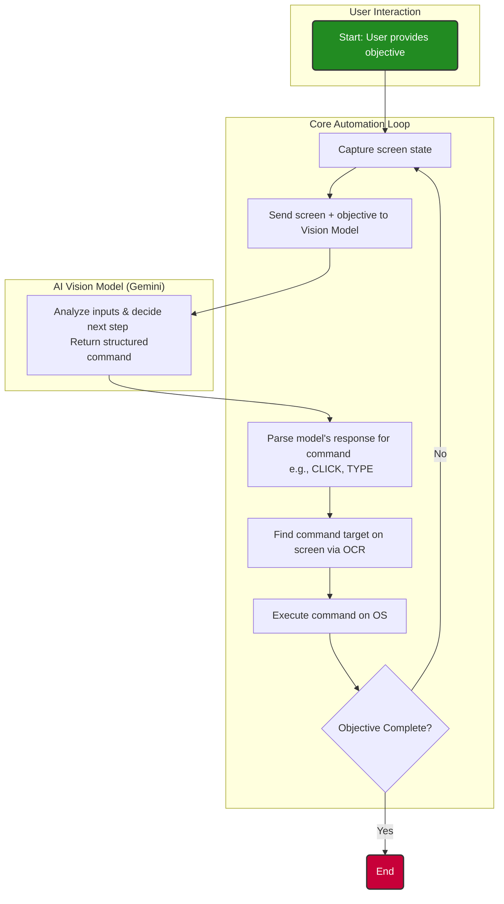

```mermaid
graph TD
    style Start fill:#228B22,stroke:#333,stroke-width:2px,color:#fff
    style End fill:#C70039,stroke:#333,stroke-width:2px,color:#fff

    subgraph "User Interaction"
        Start(Start: User provides objective)
    end

    subgraph "Core Automation Loop"
        A[Capture screen state]
        B[Send screen + objective to Vision Model]
        C[Parse model's response for command <br> e.g., CLICK, TYPE]
        D[Find command target on screen via OCR]
        E[Execute command on OS]
        F{Objective Complete?}
    end

    subgraph "AI Vision Model (Gemini)"
        G[Analyze inputs & decide next step <br> Return structured command]
    end

    Start --> A
    A --> B
    B --> G
    G --> C
    C --> D
    D --> E
    E --> F

    F -- No --> A
    F -- Yes --> End(End)
```